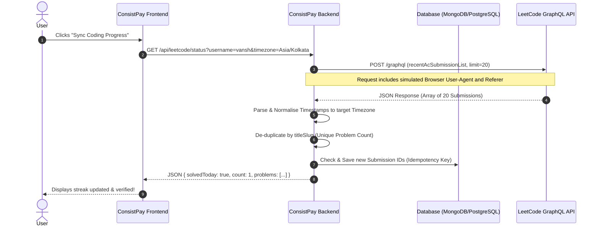

# System Architecture: LeetCode Automated Verification

This document details the architectural design for the automated LeetCode verification system of ConsistPay.

## 1. System Topology & Data Flow

The system employs a client-to-backend-to-LeetCode topology. Direct client-side requests to LeetCode's GraphQL API from the user's browser are bypassed to avoid Cross-Origin Resource Sharing (CORS) blocks and prevent exposing server-side verification logic.



---

## 2. API Schema Reference

### Endpoint
*   **Target URL:** `https://leetcode.com/graphql`
*   **Method:** `POST`
*   **Headers:**
    ```http
    Content-Type: application/json
    Referer: https://leetcode.com
    User-Agent: Mozilla/5.0 (Macintosh; Intel Mac OS X 10_15_7) AppleWebKit/537.36 (KHTML, like Gecko) Chrome/120.0.0.0 Safari/537.36
    ```

---

## 3. GraphQL Query Schemas

### A. Profile Information (`getUserProfile`)
Used exclusively for **ownership verification** to fetch the profile's public bio information.

```graphql
query getUserProfile($username: String!) {
  matchedUser(username: $username) {
    username
    profile {
      realName
      aboutMe
    }
  }
}
```

### B. Recent Accepted Submissions (`recentAcSubmissions`)
Used daily to fetch the list of completed problems.

```graphql
query recentAcSubmissions($username: String!, $limit: Int!) {
  recentAcSubmissionList(username: $username, limit: $limit) {
    id
    title
    titleSlug
    timestamp
  }
}
```

---

## 4. Key Engineering Rules

### Rule 1: Timezone Normalisation
Since LeetCode returns UNIX timestamps in UTC, the server must normalise them to the user's localized time.
*   **Algorithm:**
    1. Retrieve the client's current date string in their target timezone: `getLocalDateString(new Date(), userTimezone)` (e.g. `"07/02/2026"`).
    2. Retrieve the submission's date string in the user's target timezone: `getLocalDateString(new Date(timestamp * 1000), userTimezone)`.
    3. Match strings. This prevents false negatives on timezone boundaries (e.g. IST vs UTC).

### Rule 2: Idempotency & De-duplication
1.  **Duplicate Problems:** If a user solves the same problem multiple times in a day, the backend groups the results by `titleSlug`. The final output count increments only once per `titleSlug`.
2.  **Idempotency Keys:** Every verified daily completion record saved in our database must reference the LeetCode submission `id` as a unique index. This prevents a single submission from being re-used or claimed multiple times.
